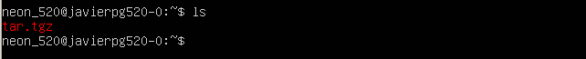
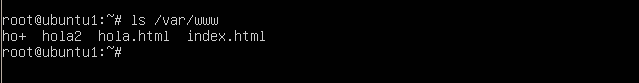
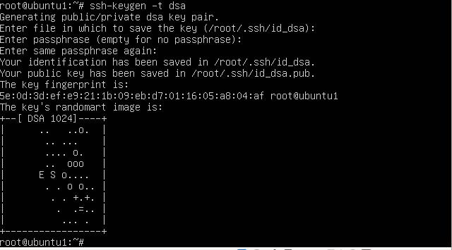
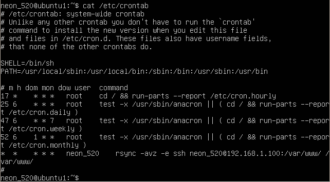

## *Práctica 2* 
- Realizado por : 
   + Antonio Solís Izquierdo
   + Javier Pérez García

Nota: Aplicamos la dirección 192.168.1.100 porque es la que corresponde a nuestra configuración.

Empezamos realizando la comprobación que hacemos de conexión, creando un archivo .tgz en nuestro servidor tal como indica el guión:

	tar czf - directorio | ssh 192.168.1.100 'cat > ~/tar.tgz'

Aquí vemos como el archivo está en la máquina servidora

	rsync -avz -e ssh root@192.168.1.100:/var/www/ /var/www/

Aquí vemos como los archivos han sido copiados

Lo siguiente que tenemos que hacer es configurar el ssh para no tener que introducir la contraseña en cada conexión

	ssh-keygen -t dsa

Aquí vemos la salida

Finalmente aplicamos la asignación de tareas con crontab, para ello modificamos el archivo /etc/crontab

En nuestro caso, para ver que realmente funcionaba hemos realizado la sincronización cada minuto, así no teníamos que esperar una hora para ver que funcionaba

