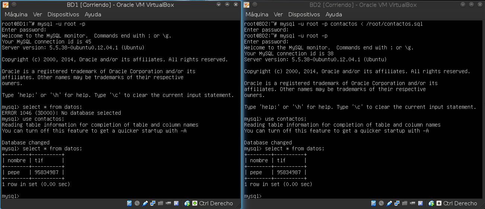
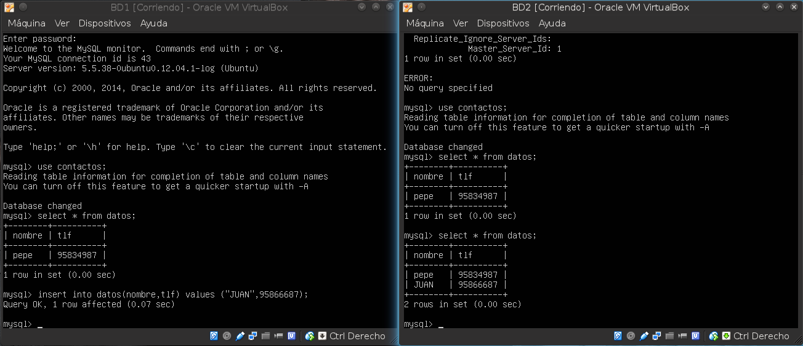
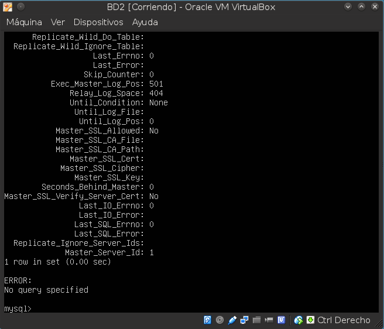

## *Práctica 5* 
- Realizado por : 
   + Antonio Solís Izquierdo
   + Javier Pérez García

Empezamos creando nuestra base de datos tal como se nos indica, nosotros hemos llamado a nuestra base de datos "contactos"

Después de ejecutar

	mysql -u root -p
	mysql> FLUSH TABLES WITH READ LOCK;
	mysql> quit

en la máquina servidora hacemos (también en la máquina servidora)

	mysqldump contactos -u root -p > /root/contactos.sql

Ahora debemos desbloquear las tablas

	mysql -u root -p
	mysql> UNLOCK TABLES;
	mysql> quit

Una vez hecho todo esto nos vamos a la máquina esclavo y ejecutamos

	scp root@192.168.1.100:/root/contactos.sql /root/

(ponemos esta IP porque es la de nuestra máquina servidora)

Con esto hecho la podemos importar la BD en MySQL. Primero crearemos la BD:

	mysql -u root -p
	mysql> CREATE DATABASE `contactos`;
	mysql> quit

A continuación restauramos los datos de la BD, aquí mostramos una imagen de lo introducido y de que funciona:

A continuación aplicaremos la configuración maestro-esclavo.

Paso 1: Abrimos, en el maestro, (con el fin de modificarlo) el archivo de configuración

	vim /etc/mysql/my.conf

Paso 2: Comentar la línea referente al parámetro bind-address

Paso 3: Ponemos la siguiente línea que nos indica donde almacenar los errores

	log_error = /var/log/mysql/error.log

Paso 4: Indicamos el ID del servidor

	server-id = 1

Paso 5: añadimos la línea

	log_bin = /var/log/mysql/bin.log

Paso 6: Guardamos el documento y reiniciamos el servidor

	/etc/init.d/mysql restart

Paso 7: Repetimos los pasos 1, 2, 3 y 5 en el esclavo. Además añadimos al archivo lo siguiente

	server-id = 2

Paso 8: Aplicamos el Paso 6 en el esclavo.

Una vez realizado todo esto volvemos al maestro y entramos en mysql. Una vez hecho esto introducimos lo siguiente:

	CREATE USER esclavo IDENTIFIED BY 'esclavo';
	GRANT REPLICATION SLAVE ON *.* TO 'esclavo'@'%' IDENTIFIED BY 'esclavo';
	FLUSH PRIVILEGES;
	FLUSH TABLES;
	FLUSH TABLES WITH READ LOCK;

Ahora, ejecutamos (sin salirnos de mysql) y anotamos lo que nos sale

	SHOW MASTER STATUS;

Una vez hecho todo esto nos volvemos al esclavo y ejecutamos mysql y ponemos (con los datos anotados previamente)

	CHANGE MASTER TO MASTER_HOST='192.168.31.200', MASTER_USER='esclavo', MASTER_PASSWORD='esclavo', MASTER_LOG_FILE='mysql-bin.000001', MASTER_LOG_POS=501, MASTER_PORT=3306;

Finalmente ponemos

	START SLAVE;

Ahora, en el maestro damos acceso a tablas

	UNLOCK TABLES;

A continuación mostramos 2 imágenes, una indicando el funcionamiento y otra la comprobación de errores:

