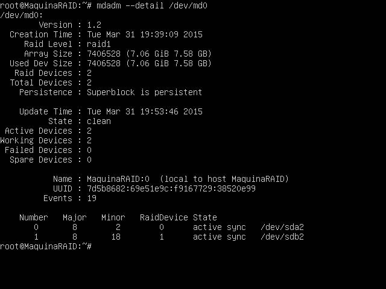

## *Práctica 6* 
- Realizado por : 
   + Antonio Solís Izquierdo
   + Javier Pérez García

Para realizar esta práctica nos hemos basado en una práctica realizada el año anterior en la asignatura de Ingeniería de Servidores.

Una vez indicado esto, empecemos:

Durante la instalación de UbuntuServer nos centraremos solo en la parte referente a la instalación del RAID, obviamos que por las prácticas anteriores el resto se sabe.

En la pantalla "Particionado de discos" seleccionamos "Manual", seleccionamos un disco y le damos a "Sí" cuando nos pregunte si crear una nueva tabla de particiones. 

A continuación pulsamos sobre espacio no particionado y elegimos la opción "Crear una partición nueva".

Ahora le ponemos el tamaño que queramos (con un 1Gb está bien), después nos pregunta que tipo de partición y elegimos "Primaria". La ubicación la ponemos en "Principio".

En la siguiente pantalla que nos salga le damos a "Utilizar como:" y seleccionamos "área de intercambio"

Finalmente seleccionamos "Se ha terminado de definir la partición"

Una vez de vuelta en la pantalla principal de particionado seleccionamos de nuevo el espacio libre y le damos otra vez a "Crear una partición nueva".

Esta vez elegimos todo el espacio que nos quedaba libre y la ponemos como "Primaria". En la pantalla de configuración de la partición en "Utilizar como:" elegimos "volumen físico para RAID"

Le damos ahora a "Se ha terminado de definir la partición"

Ya hemos configurado un disco, repetimos todo este proceso con el otro.

Una vez hechos los dos discos pulsaremos en "configurar RAID por software" y le daremos a "Sí" para escribir los cambios. 

Después pulsamos sobre "Crear un dispositivo MD" y elegimos "RAID1". En el número de dispositivos le ponemos 2 y en el libres 0 (en este caso es así).

Elegimos ahora las 2 particiones que formarán el RAID1 y le damos a "Terminar"

Al volver a la ventana principal de particionado veremos como tenemos un nuevo dispositivo RAID1. Ahora vamos a asignarle un sistema de ficheros y un punto de montaje. Lo seleccionamos para configurarlo, en "Utilizar como:" seleccionamos "sistema de ficheros ext4 transaccional".

En "Punto de montaje:" seleccionamos "/ - sistema de ficheros raiz".

Le damos ahora a "Se ha terminado de definir la partición".

Finalmente le damos a "Sí" en las 2 siguientes preguntas que se nos hacen al respecto.

A continuación mostramos una imagen que nos muestra que está bien instalado.

